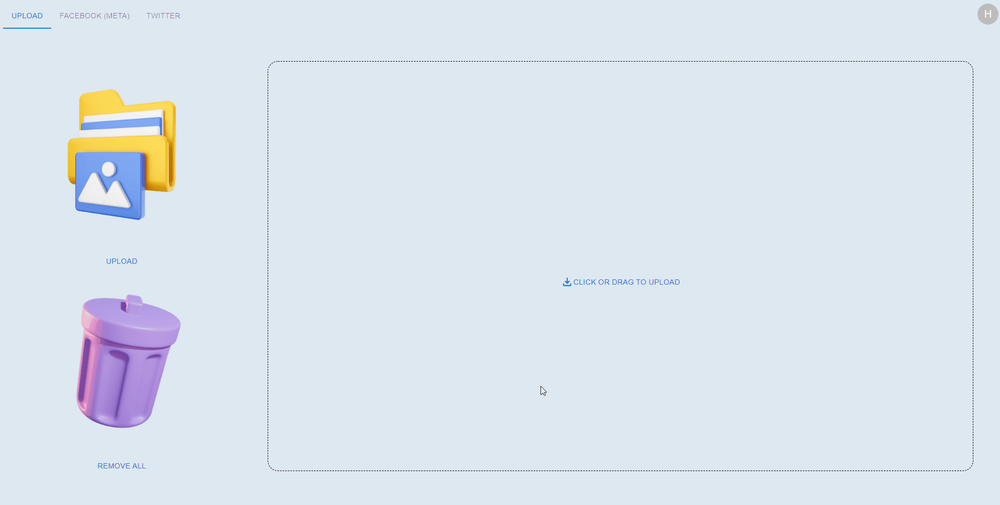

<h1 align="center">Media In One</h1>

## Demo

## **💭 Inspiration** 
Nowadays, there are so many social media platforms available. Don't you hate it when you have to go to every social media platform when you want to post on several social media platforms?

Media In One is an awesome solution for posting social media posts on different platforms or when you need help writing descriptions and captions!

## **✨ What it does**
Media In One is a website that helps you post on social media without having to hop onto different social media platforms! Our website also includes a caption generator that gives you a template caption relevant to your posts. 

→  Login to all of your social media accounts and access them all on 1 platform

→  Post on all of your different social media accounts with the push of a button

→  Generate captions for your images to make your content more accessible

→  Not sure what to write for your descriptions? Use one of the several templates to help you out

→  Use the suggested tags to make your content optimised for SEO

## **🛠 How we built it**
UI/UX: Figma

Frontend: HTML, CSS, React

Backend: Firebase

## **🎯 Challenges we ran into**
→  Failure in model deployment. We initially planned on hosting an ML model that would be able to generate captions for us but this unfortunately didn’t happen because of a Heroku slug limit (ie. the ML model was too big to be deployed on Heroku); we also tried other deployment methods like GCP but to no avail.

→  Time and scope. We didn’t have enough time to finish a large project like this and we probably shouldn’t have scoped out such a large project in the first place.

→  We were also unable to implement the social media APIs as most of them required us to verify our app which could take up to 30 days. However, we did write quite a big chunk of code that would work if we were verified :,

## **💪 Accomplishments that we're proud of**
→ We succeed in authenticating third party API.

→ We were able to make it through the hackathon without running into too many horrifying merge conflicts.

→ Implementing a fully-functional authentication system.
Succeed in deploying our website.

## **📖 What we learned**
→ How to use Firebase and React

→ Authenticating third party API

→ Teamwork makes the dream work 🌈

## **⛳️ What's next for Media In One?**
→ Add a translate caption feature to compromise other users from different regions as target audience. 

→ Add more social media platforms such as Pinterest, Instagram and more. 

→ Upload and share not only pictures but also videos!

→ Photo editing: cropping, applying filters and more.

→ Add tags on pictures to tag other users. 

→ Built-in scheduling facilities for scheduling posts and planning. 
